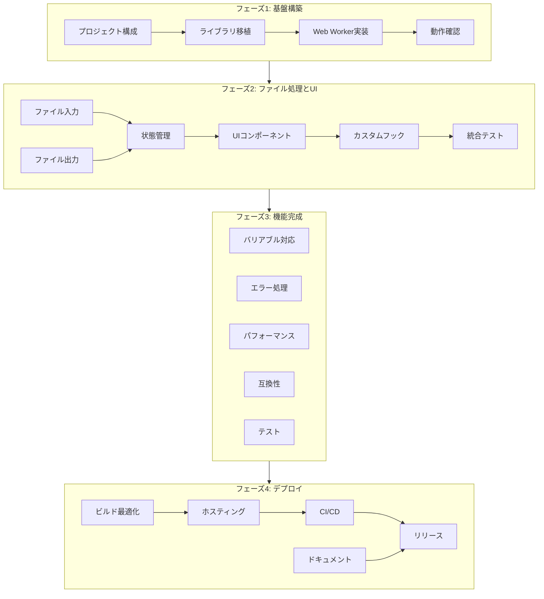

# FontMinify Web版 タスクリスト

作成日: 2024-12-14

## 概要

Web版対応を4フェーズに分けて実装する。各フェーズは独立してリリース可能な単位とする。

---

## 実装開始前の準備

### 技術的決定事項（確定）

| 項目 | 決定内容 | 備考 |
|-----|---------|------|
| サブセット化 | harfbuzzjs (WASM直接使用) | subset-fontはNode.js専用のため不可 |
| WOFF2圧縮 | woff2-encoder | TTF → WOFF2変換 |
| フォント解析 | fontkit | ブラウザ対応済み |
| 重い処理 | Web Worker | UIブロッキング回避 |
| ファイル入出力 | File API / Blob Download | ブラウザ標準API |

### 処理パイプライン（確定）

```
入力フォント (TTF/OTF/WOFF/WOFF2)
    ↓
fontkit (フォント解析・メタデータ取得)
    ↓
harfbuzzjs WASM (サブセット化)
    ↓
TTF (サブセット済み)
    ↓
woff2-encoder (WOFF2出力時のみ)
    ↓
Blob Download (ファイル保存)
```

### 事前準備タスク

実装開始前に以下を完了させる：

- [ ] **0.1** woff2-encoderライブラリのインストール
  ```bash
  npm install woff2-encoder
  ```

- [ ] **0.2** harfbuzzjs WASMファイルの配置確認
  - `node_modules/harfbuzzjs/hb-subset.wasm` が存在することを確認
  - Viteでの読み込み設定を確認

### 参照ドキュメント

- 技術調査: [web-version-research.md](./web-version-research.md) - PoC検証結果
- 設計書: [web-version-design.md](./web-version-design.md) - アーキテクチャ詳細
- 仕様書: [web-version-spec.md](./web-version-spec.md) - 機能要件
- PoCコード: `poc/main.ts` - harfbuzzjs実装例

---

## フェーズ1: 基盤構築

**目標**: Web版のビルド環境とWeb Worker基盤を構築する

### 1.1 プロジェクト構成

- [ ] **1.1.1** `src/web/` ディレクトリ構成を作成
  - `src/web/main.tsx`
  - `src/web/App.tsx`
  - `src/web/index.html`
  - `src/web/workers/`
  - `src/web/services/`
  - `src/web/hooks/`

- [ ] **1.1.2** Web版Vite設定ファイルを作成
  - `src/web/vite.config.ts`
  - パスエイリアス設定（@web, @shared, @lib, @renderer）
  - Web Worker設定
  - WASM対応設定

- [ ] **1.1.3** package.jsonにWeb版スクリプトを追加
  - `dev:web` - 開発サーバー起動
  - `build:web` - プロダクションビルド
  - `preview:web` - ビルドプレビュー

- [ ] **1.1.4** TypeScript設定を追加
  - `tsconfig.web.json` 作成
  - Web Worker用の型定義

### 1.2 フォント処理ライブラリ移植

- [ ] **1.2.1** `src/lib/fontAnalyzer.ts` を作成
  - `src/main/services/fontAnalyzer.ts` をベースに移植
  - `fs.readFileSync` → `Uint8Array` 引数に変更
  - `Buffer` → `Uint8Array` に変換
  - fontkitのUint8Array入力対応を確認

- [ ] **1.2.2** `src/lib/fontSubsetter.ts` を作成
  - harfbuzzjs WASMを直接使用（subset-fontはNode.js専用のため使用不可）
  - `poc/main.ts` の実装をベースに移植
  - AbortSignalによるキャンセル対応を追加
  - プログレスコールバックの型を統一

- [ ] **1.2.3** `src/lib/woff2Encoder.ts` を作成
  - woff2-encoderライブラリを使用
  - TTF → WOFF2 変換処理を実装
  - fontSubsetterと統合

- [ ] **1.2.4** ライブラリのブラウザ動作確認
  - harfbuzzjs WASMの読み込み確認（PoC検証済み）
  - woff2-encoderの動作確認
  - fontkitのArrayBuffer対応確認

### 1.3 Web Worker実装

- [ ] **1.3.1** Worker通信型定義を作成
  - `src/web/workers/types.ts`
  - WorkerRequest / WorkerResponse 型
  - ペイロード型（Analyze, Subset, Progress, Error）

- [ ] **1.3.2** フォント処理Workerを実装
  - `src/web/workers/font.worker.ts`
  - analyze / subset / cancel ハンドラー
  - AbortController管理
  - エラーハンドリング

- [ ] **1.3.3** Worker APIブリッジを実装
  - `src/web/services/fontProcessor.ts`
  - FontProcessorクラス（シングルトン）
  - Promise化されたAPI
  - プログレスコールバック対応

### 1.4 動作確認

- [ ] **1.4.1** 最小構成でのWorker動作確認
  - 単純なメッセージ送受信テスト
  - WASM読み込みテスト

- [ ] **1.4.2** フォント解析の動作確認
  - 小さいフォントファイルで解析テスト
  - 結果の正確性確認

---

## フェーズ2: ファイル処理とUI

**目標**: ファイル入出力とUIコンポーネントを実装する

### 2.1 ファイル入力処理

- [ ] **2.1.1** File APIラッパーを実装
  - `src/web/services/fileHandler.ts`
  - `readFileAsUint8Array()` - FileReader
  - `validateFontFile()` - 拡張子・サイズ検証

- [ ] **2.1.2** ドラッグ&ドロップ対応
  - FileDropZoneコンポーネントの修正
  - File[]を直接処理する形に変更

### 2.2 ファイル出力処理

- [ ] **2.2.1** ダウンロード処理を実装
  - `src/web/services/downloadManager.ts`
  - `downloadFile()` - Blob + a要素
  - MIMEタイプ判定
  - ファイル名生成

- [ ] **2.2.2** File System Access API対応（オプション）
  - 対応ブラウザ判定
  - `showSaveFilePicker` によるファイル保存
  - フォールバック（通常ダウンロード）

### 2.3 状態管理修正

- [ ] **2.3.1** Zustand Store構造を修正
  - `src/web/stores/fontStore/state.ts`
  - `filePath: string` → `fileId + File + Uint8Array`
  - ファイル状態管理（pending/analyzing/ready/error）

- [ ] **2.3.2** ファイルアクションを修正
  - `src/web/stores/fontStore/actions.ts`
  - addFiles - File[]を受け取り、読み込み・解析
  - removeFile / clearFiles

- [ ] **2.3.3** 処理アクションを修正
  - processFont - fontProcessor経由で処理
  - cancelProcessing - Worker経由でキャンセル
  - プログレス更新

### 2.4 UIコンポーネント移植

- [ ] **2.4.1** 共通コンポーネントをコピー/修正
  - `src/renderer/components/` から必要なものをコピー
  - ElectronAPI依存部分を削除/修正
  - インポートパス修正

- [ ] **2.4.2** FileDropZoneを修正
  - `window.electronAPI.selectFiles` → input[type=file]
  - ファイルパスではなくFileオブジェクトを扱う

- [ ] **2.4.3** FontInfoPanelを修正
  - ファイルパス表示 → ファイル名表示
  - 解析結果の表示はそのまま流用

- [ ] **2.4.4** CharacterSetPanelを流用
  - ほぼ変更なしで流用可能
  - プリセット定義は`src/shared/`から参照

- [ ] **2.4.5** ProgressPanelを修正
  - onProgressUpdate → Zustand経由で取得
  - 表示ロジックはそのまま流用

### 2.5 カスタムフック修正

- [ ] **2.5.1** useFontProcessingを修正
  - `src/web/hooks/useFontProcessing.ts`
  - ElectronAPI呼び出し → fontProcessor呼び出し
  - ダウンロード処理統合

### 2.6 統合テスト

- [ ] **2.6.1** E2Eでの基本フロー確認
  - ファイル選択 → 解析 → 表示
  - 文字セット選択
  - サブセット化 → ダウンロード

---

## フェーズ3: 機能完成

**目標**: 全機能を実装し、品質を向上させる

### 3.1 バリアブルフォント対応

- [ ] **3.1.1** バリアブル軸検出を確認
  - fontkitでの軸情報取得
  - Web版での動作確認

- [ ] **3.1.2** VariableAxisControlの動作確認
  - 軸の値設定UI
  - サブセット化時の軸固定

### 3.2 エラーハンドリング強化

- [ ] **3.2.1** エラー型を整理
  - `src/shared/errors.ts` にWeb版エラーを追加
  - エラーコードとメッセージのマップ

- [ ] **3.2.2** Worker内エラーハンドリング
  - try-catchの網羅
  - エラー詳細の伝播

- [ ] **3.2.3** UIエラー表示
  - エラートースト表示
  - 詳細展開機能
  - 再試行ボタン

### 3.3 パフォーマンス最適化

- [ ] **3.3.1** 大きなフォントの処理確認
  - 10MB以上のフォントでテスト
  - メモリ使用量モニタリング
  - 処理時間計測

- [ ] **3.3.2** WASM読み込み最適化
  - 遅延読み込みの検討
  - キャッシュ戦略

- [ ] **3.3.3** バンドルサイズ最適化
  - Tree shaking確認
  - コード分割（lazy loading）

### 3.4 ブラウザ互換性

- [ ] **3.4.1** 対象ブラウザでの動作確認
  - Chrome 89+
  - Firefox 78+
  - Safari 15+
  - Edge 89+

- [ ] **3.4.2** WebAssembly非対応時のエラー表示
  - 機能チェック
  - わかりやすいエラーメッセージ

### 3.5 テスト

- [ ] **3.5.1** ユニットテスト作成
  - fontAnalyzer テスト
  - fontSubsetter テスト
  - fileHandler テスト

- [ ] **3.5.2** Worker統合テスト
  - メッセージ送受信
  - キャンセル処理
  - エラーハンドリング

- [ ] **3.5.3** E2Eテスト作成（Playwright）
  - 基本フロー
  - エラーケース
  - 複数ファイル処理

---

## フェーズ4: デプロイ準備

**目標**: 本番環境へのデプロイと運用準備

### 4.1 ビルド最適化

- [ ] **4.1.1** プロダクションビルド確認
  - minification
  - source map設定
  - 出力ファイルサイズ確認

- [ ] **4.1.2** 静的アセット最適化
  - 画像圧縮（あれば）
  - フォント（UIフォント）最適化

### 4.2 ホスティング設定

- [ ] **4.2.1** Vercel設定ファイル作成
  - `vercel.json`
  - COOP/COEPヘッダー設定
  - リダイレクト設定

- [ ] **4.2.2** GitHub Pages設定（代替）
  - GitHub Actions ワークフロー
  - ベースパス設定

### 4.3 CI/CD

- [ ] **4.3.1** GitHub Actions ワークフロー作成
  - `.github/workflows/deploy-web.yml`
  - ビルド → テスト → デプロイ
  - プルリクエスト時のプレビューデプロイ

- [ ] **4.3.2** 自動テスト設定
  - ユニットテスト実行
  - E2Eテスト実行（ヘッドレス）

### 4.4 ドキュメント

- [ ] **4.4.1** README更新
  - Web版の使い方
  - 開発環境セットアップ
  - ビルド・デプロイ手順

- [ ] **4.4.2** CONTRIBUTING.md更新（あれば）
  - Web版開発ガイド

### 4.5 リリース

- [ ] **4.5.1** 最終動作確認
  - 本番環境での動作テスト
  - パフォーマンス確認

- [ ] **4.5.2** リリースノート作成
  - 新機能（Web版）の説明
  - 既知の制限事項

---

## タスク依存関係



---

## 見積もり

| フェーズ | タスク数 | 概算工数 |
|---------|---------|---------|
| 事前準備 | 2 | 0.5日 |
| フェーズ1 | 14 | 2-3日 |
| フェーズ2 | 17 | 3-4日 |
| フェーズ3 | 13 | 2-3日 |
| フェーズ4 | 9 | 1-2日 |
| **合計** | **55** | **8-12日** |

※ 既存コードの流用度が高いため、比較的短期間での実装が可能
※ PoCで検証済みのため、技術的リスクは低い

---

## 優先度の高いタスク（MVP）

最小限の動作可能な製品（MVP）に必要なタスク:

1. **0.1** - woff2-encoderインストール
2. **1.1.1** - プロジェクト構成
3. **1.1.2** - Vite設定
4. **1.2.1** - fontAnalyzer移植
5. **1.2.2** - fontSubsetter移植（harfbuzzjs直接使用）
6. **1.2.3** - woff2Encoder実装
7. **1.3.1** - Worker型定義
8. **1.3.2** - Worker実装
9. **1.3.3** - Worker APIブリッジ
10. **2.1.1** - ファイル入力
11. **2.2.1** - ダウンロード処理
12. **2.3.1-3** - 状態管理
13. **2.4.1-5** - UIコンポーネント

MVPは約5-7日で達成可能。

---

## 更新履歴

| 日付 | 内容 |
|------|------|
| 2024-12-14 | 初版作成 |
| 2024-12-14 | PoC検証結果を反映。subset-font→harfbuzzjs直接使用に変更、woff2-encoder追加、実装開始前の準備セクション追加 |
